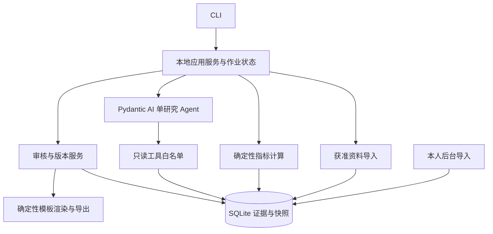

# 技术设计（目标态）

当前 v0.3.0 已实现 S1 契约、S2/S3 本地核心及 S4 研究工程。本文仍包含后续目标设计；实际边界见 [数据契约](08-data-contract.md) 和 [当前进度](07-status.md)。

## 模块与调用方向

建议模块：`domain/` Pydantic 模型；`adapters/` JSON、CSV 及后续只读来源；`storage/` SQLite 迁移与查询；`analysis/` 计算和研究；`creation/` 草稿与模板；`review/` 状态机；`jobs/` 预算/恢复；`cli.py` 命令入口。避免一开始部署独立服务。

SQLite 存结构化数据；原始获准文件和自有素材放本地受控目录，以 SHA-256 寻址。开外键，迁移有版本号，写入用事务。所有时间带时区，数据库转 UTC，显示可转用户时区。

## 数据对象

| 对象 | 核心字段与约束 |
|---|---|
| ResearchBrief | id、目标、人群、问题、产品事实版本、禁用说法、预算、采样计划 |
| SourceGrant | id、来源、授权依据引用、有效期、存储/本地分析/云处理/摘录输出/图片复用许可、保留期；unknown 与 denied 都不开放对应操作 |
| SamplingRun | brief_id、数据源、关键词、排序、时间窗口、热门/近期组、目标量、实际量、失败及截断 |
| EvidenceRecord | id、source_id、external_id、类型(note/comment)、parent_id、作者伪名、文本、来源定位、observed_at、内容哈希、synthetic、采样关系 |
| MetricSnapshot | evidence_id、指标名、value 可空、raw_display、source_kind、precision、definition、unit、observed_at、missing_reason |
| ProductFact / Asset | 事实状态 verified/unverified、产品版本、验证素材/哈希、验证时间；素材所有者、许可、用途、路径 |
| ResearchFinding | claim、status(finding/hypothesis)、support_refs、counter_refs、反例检索状态、样本范围、局限、模型与提示版本 |
| CreativeProposal | brief_id、版本、事实引用、发现引用、标题/正文、分镜、假设、测试目标、缺口 |
| ReviewDecision | bundle_id、版本、内容及素材哈希、reviewer、decision、理由、时间 |
| OutcomeSnapshot | published_note_id、proposal_version、发布/观察时间、实际窗口、自有/估算来源、指标口径、归因方法 |
| Job / AuditEvent | id、输入哈希、阶段、断点、预算消耗、错误类型、操作者、版本与事件时间 |

证据正文变更生成修订，不能覆盖已引用内容。去重键优先 `(source_id, external_id)`；无外部 ID 时使用规范化来源与内容哈希，并标记弱身份。证据修订和指标快照独立；同一笔记可属于多个采样词，但总体数量只计一次。指标幂等键包含笔记、指标名、来源、口径、观察时间；冲突值报错待审。

引用至少包含 evidence_id、revision、字段、文本区间和摘录哈希；模型返回的引用必须经过存在性和区间校验。评论作者以项目内带盐哈希伪名统计，未知作者不伪造为多个独立作者。

## 指标计算规格 v1

- 数量 `value` 非负有限数值或 null；缺失要有原因。`0` 只表示明确观察到零。
- `1.2万` 保存 raw_display 与近似 value=12000、precision=abbreviated；不推断显示舍入规则，不声称精确增长。
- 先固定可比组：话题、形式、发布龄区间（0–7、8–30、31–90、91+ 天）与账号规模区间（<1k、1k–10k、10k+）。缺少分组字段时进入 unknown 描述组，不参与严格综合排序。发布龄相对指标观察时刻计算。
- 综合排名只用三项指标齐全、来源/精度类别及定义兼容的同组样本，默认 n≥20。样本不足不评分，不动态重分配权重。
- 单项使用从小到大平均秩 r（从 1 开始）；分位 p=(r-1)/(n-1)，并列取平均秩。综合分=100×(0.25×p_like+0.45×p_save+0.30×p_comment)。保留组 ID、n、权重及计算版本；只显示一位小数。
- 分享独立展示；后续四指标版本须全组四项完整并另立版本，不能混用。
- 同源、同定义的两个时间快照才计算区间差值；负值保留并标异常，禁止截断成零。时间倒置拒绝。近似值差仅标“近似差值”，不用于精细增长结论。
- 无分母或分母为零时不算比率；真实 CTR 还要求同一授权后台、同一窗口和一致事件定义，不能把阅读/曝光或收藏/阅读误名为点击率。

## 模型与工具

先做本地模型能力探针：结构化输出、中文抽取、引用正确性、工具调用、上下文预算；视觉单独测试。Pydantic AI 版本在 S4 接入时锁定。模型计算结果不作为数值真值，统计由 Python 提供。每批 5–10 篇，分批分析再合并，运行预算计入重试，输出解析最多修复两次。

工具只注册 `get_note_evidence`、`get_comment_sample`、`compare_metrics`；有获准在线源时再启用 `search_notes`；有获准图片和视觉能力时才启用视觉分析。模型无 shell、任意 HTTP、数据库写入或审核权限，第三方 MCP 由网关显式映射白名单，未知操作默认拒绝。

笔记/评论视为不可信数据。引文中的“打开链接/忽略规则”不改变操作；离线分析默认禁止联网。凭据留在适配器进程或系统凭据存储，不进入快照、模型上下文和常规日志。远端图片抓取如启用需阻止私网地址、重定向绕过及非允许域名。

## 状态、审核与恢复

研究作业：`created → importing → analysing → complete | partial | failed`。内容包：`draft → in_review → approved | rejected → exported`。任何内容或素材修改产生新版本 draft，旧审核只能证明旧版本。

批准事务记录确切 bundle 哈希；export 在事务中核验审核和固定版本，使用该版本的不可变素材复制件，完成后逐文件校验哈希和写 manifest。临时目录生成，成功后原子替换。相同版本重试幂等，不误导出最新未批准草稿。草稿预览可以无批准，但需明显水印且不能生成正式 export manifest。

MVP 用同进程确定性作业执行器，失败写断点而非吞掉错误。S8 网络错误：401 暂停重新授权；403/验证码熔断；429 按 Retry-After 在预算内最多重试两次；字段漂移为 schema_error；超时可重试但保留部分结果。

保留期默认建议 30 天，最终以来源许可中更短期限为准；到期暂停使用。删除源记录需处理原文、派生缓存、报告和模型缓存，引用标为 revoked 并使待导出包失效；备份需有过期淘汰策略。导出包单列允许包含的摘录和素材，不能把整批原始评论默认带出去。
